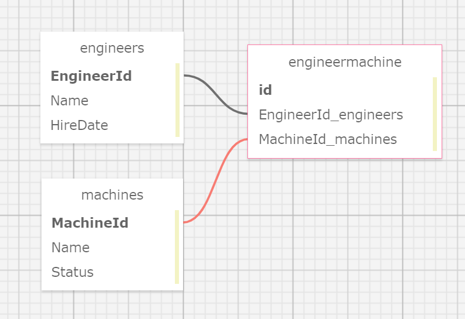

# _Dr SillyStringz Factory_

#### _Many to Many Database Relationship Solo Project_ 
#### _DATE 01.08.2021_

#### By _**Tawnee Harris**_

## Description

This application will allow Dr. SillyStringz to manage engineers and machines in his factory. 

## Setup/Installation Requirements

Software Requirements
* An internet browser of your choice; I prefer Chrome
* A code editor; I prefer VSCode
* .NET Core
* MySQL
* MySQL Workbench

Open by Downloading or Cloning
* Navigate to <https://github.com/tawneeh/Factory.Solution.git>
* Download this repository to your computer by clicking the green Code button and 'Download Zip'
* Or clone the repository

AppSettings
* This project requires an AppSettings file. Create your `appsettings.json` file in the main `Factory` directory. 
* Format your `appsettings.json` file as follows including your unique password that was created at MySqlWorkbench installation:
```
{
  "ConnectionStrings":{
      "DefaultConnection": "Server=localhost;Port=3306;database=tawnee_harris_1;uid=root;pwd=<YourPassword>;"
  }
}
```
* Update the Server, Port, and User ID as needed.

Import Database using Entity Framework Core
* Navigate to Factory.Solution/Factory and type `dotnet ef migrations add <MigrationName>` into the terminal
* Then, type `dotnet ef database update` into the terminal to create your database tables.

DB SQL Schema Snippet
* Paste this Schema Create Statement into your SQL Workbench to create this database and its tables.
```
CREATE DATABASE `tawnee_harris_1` /*!40100 DEFAULT CHARACTER SET utf8mb4 COLLATE utf8mb4_0900_ai_ci */ /*!80016 DEFAULT ENCRYPTION='N' */;
USE tawnee_harris_1;
CREATE TABLE `__efmigrationshistory` (
  `MigrationId` varchar(95) NOT NULL,
  `ProductVersion` varchar(32) NOT NULL,
  PRIMARY KEY (`MigrationId`)
) ENGINE=InnoDB DEFAULT CHARSET=utf8mb4 COLLATE=utf8mb4_0900_ai_ci;
CREATE TABLE `engineermachine` (
  `EngineerMachineId` int NOT NULL AUTO_INCREMENT,
  `EngineerId` int NOT NULL,
  `MachineId` int NOT NULL,
  PRIMARY KEY (`EngineerMachineId`),
  KEY `IX_EngineerMachine_EngineerId` (`EngineerId`),
  KEY `IX_EngineerMachine_MachineId` (`MachineId`),
  CONSTRAINT `FK_EngineerMachine_Engineers_EngineerId` FOREIGN KEY (`EngineerId`) REFERENCES `engineers` (`EngineerId`) ON DELETE CASCADE,
  CONSTRAINT `FK_EngineerMachine_Machines_MachineId` FOREIGN KEY (`MachineId`) REFERENCES `machines` (`MachineId`) ON DELETE CASCADE
) ENGINE=InnoDB AUTO_INCREMENT=28 DEFAULT CHARSET=utf8mb4 COLLATE=utf8mb4_0900_ai_ci;
CREATE TABLE `engineers` (
  `EngineerId` int NOT NULL AUTO_INCREMENT,
  `Name` longtext,
  `HireDate` longtext,
  PRIMARY KEY (`EngineerId`)
) ENGINE=InnoDB AUTO_INCREMENT=10 DEFAULT CHARSET=utf8mb4 COLLATE=utf8mb4_0900_ai_ci;
CREATE TABLE `machines` (
  `MachineId` int NOT NULL AUTO_INCREMENT,
  `Name` longtext,
  `Status` longtext,
  PRIMARY KEY (`MachineId`)
) ENGINE=InnoDB AUTO_INCREMENT=9 DEFAULT CHARSET=utf8mb4 COLLATE=utf8mb4_0900_ai_ci;
```

SQL Database Design
<center>

</center>

Launch this Application
* Navigate to Factory.Solution/Factory and type `dotnet restore` into the terminal
* Then, in the same project folder, type `dotnet build` into the terminal followed by `dotnet run`
* Peruse this application at your leisure

## Known Bugs

This application has no known bugs. 

## Support and contact details

* Please feel free to reach out to me anytime at <tawneeh@icloud.com>

## Technologies Used

* C#
* Razor
* Entity Framework Core
* MySql
* MySql Workbench

### License

[](https://opensource.org/licenses/MIT)

Copyright (c) 2021 **_Tawnee Harris_**